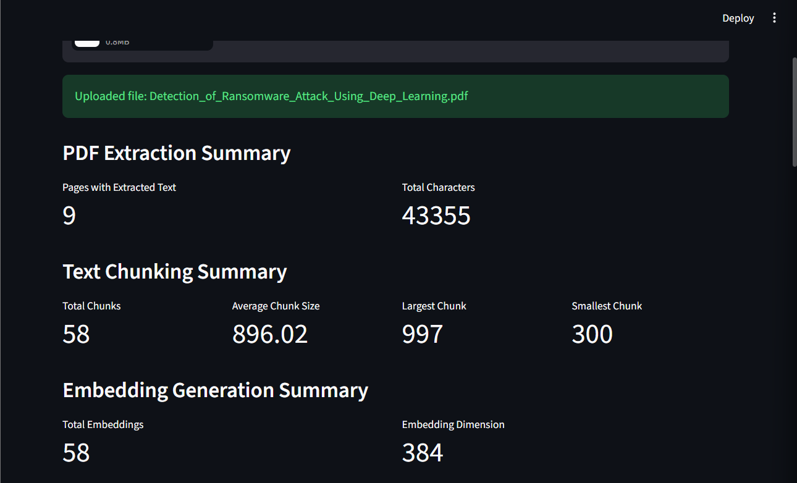
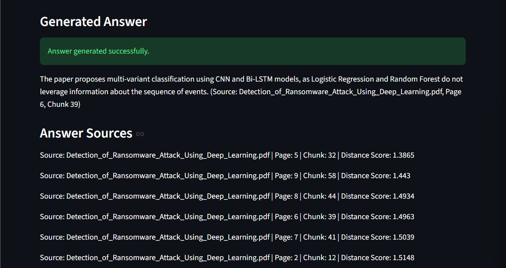
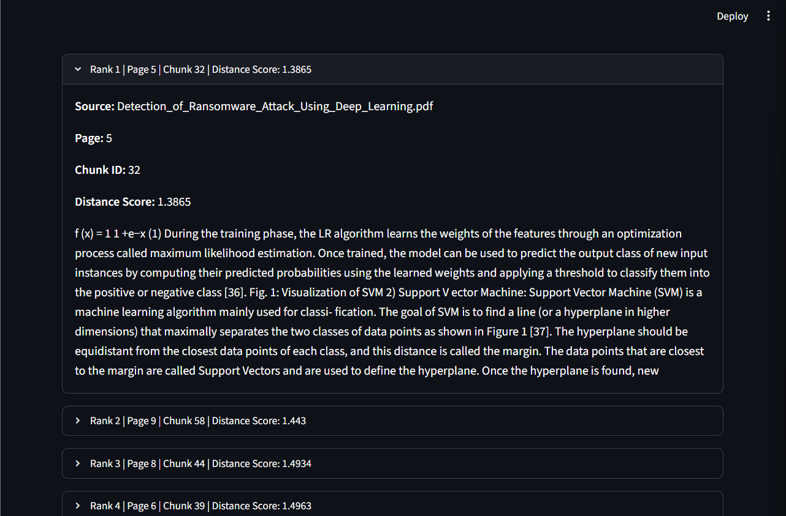

# Bangla-English RAG Chatbot

A multilingual PDF-based Retrieval-Augmented Generation chatbot that allows users to upload Bangla or English PDF documents, ask questions, retrieve relevant document chunks using vector search, and generate source-grounded answers with page references using Gemini.

## Project Overview

This project demonstrates an end-to-end LLM application pipeline for document-based question answering. The system extracts text from uploaded PDFs, splits the document into meaningful chunks, generates multilingual embeddings, stores them in ChromaDB, retrieves relevant chunks through semantic search, and produces final answers using Gemini.

The project is designed as a portfolio-grade AI engineering project focused on RAG, multilingual NLP, vector search, and LLM-powered document intelligence.

## Key Features

- PDF upload and text extraction
- Page-wise document processing
- Text chunking with overlap
- Multilingual embeddings for Bangla and English
- ChromaDB vector storage
- Semantic similarity search
- Gemini-powered answer generation
- Source-grounded answers with page and chunk references
- Streamlit web interface
- Secure API key management using .env

## Tech Stack

- Python
- Streamlit
- LangChain
- ChromaDB
- Sentence Transformers
- Google Gemini
- pypdf
- python-dotenv

## RAG Pipeline

``` text
PDF Upload
→ Text Extraction
→ Text Chunking
→ Multilingual Embeddings
→ ChromaDB Vector Store
→ Semantic Search
→ Gemini Answer Generation
→ Source-grounded Response
```
## App Screenshots

### App Overview



### Source-Grounded Answer Generation



### Retrieved Sources and Relevant Chunks



## Project Structure

``` text
bangla-english-rag-chatbot/
│
├── app.py
├── README.md
├── requirements.txt
├── .gitignore
├── .env.example
│
├── src/
│   ├── __init__.py
│   ├── pdf_loader.py
│   ├── text_splitter.py
│   ├── embeddings.py
│   ├── vector_store.py
│   ├── rag_chain.py
│   └── utils.py
│
└── data/
    └── .gitkeep
```

## How to Run Locally

### 1. Clone the repository

``` bash
git clone https://github.com/NafizNoyon/bangla-english-rag-chatbot.git
cd bangla-english-rag-chatbot
```

### 2. Create a virtual environment

``` bash
python -m venv .venv
```

### 3. Activate the environment

For Windows PowerShell:

``` bash
.\.venv\Scripts\Activate.ps1
```

For Windows CMD:

``` bash
.venv\Scripts\activate
```

### 4. Install dependencies

``` bash
pip install -r requirements.txt
```

### 5. Configure Gemini API key

Create a .env file in the project root and add:

``` env
GOOGLE_API_KEY=your_google_gemini_api_key_here
```

### 6. Run the app

``` bash
streamlit run app.py
```

## Example Questions

``` text
What is the main objective of this paper?
What is the main methodology of this paper?
Which deep learning models are used in this paper?
এই পেপারের মূল উদ্দেশ্য কী?
এই পেপারের মূল methodology কী?
```

## Skills Demonstrated

- Retrieval-Augmented Generation
- LLM application development
- Multilingual NLP
- Vector embeddings
- Semantic search
- PDF document processing
- Streamlit application development
- Secure environment variable handling
- Modular Python project architecture
- Source-grounded answer generation

## Future Improvements

- Add chat history
- Add multi-PDF support
- Add document summary generation
- Add reranking for improved retrieval quality
- Add downloadable answer reports
- Add Docker support
- Add FastAPI backend
- Add Streamlit Cloud deployment
